# Mechanistic Interpretability: Dissecting the Induction Circuit

Hands-on mechanistic interpretability experiments that locate, verify, and dismantle the
**induction circuit** — the attention-head mechanism behind in-context learning — across
four models from three labs and three architecture eras: GPT-2-small (OpenAI, 2019),
Pythia-1.4B (EleutherAI, 2023), Qwen3-1.7B (Alibaba, 2025), and the hybrid-attention
Qwen3.5-2B (2026).

Each experiment is a small, self-contained script built on
[TransformerLens](https://github.com/TransformerLensOrg/TransformerLens). The sequence
follows the standard interpretability workflow: **observe** a behaviour, **localize** the
components that correlate with it, then **intervene causally** to prove they implement it.
Experiments 01–07 dissect the induction circuit; experiments 08–09 apply the same
locate-then-ablate playbook to AI safety — finding the refusal direction in a chat model,
then using it to probe whether "unlearned" models truly forgot or merely learned to suppress.

## Key results

| | GPT-2-small | Pythia-1.4B | Qwen3-1.7B | Qwen3.5-2B |
|---|---|---|---|---|
| Architecture | 12L × 12H, all softmax | 24L × 16H, all softmax | 28L × 16H, all softmax | 24L × 8H, **6 softmax + 18 linear-attn layers** |
| Induction heads found | 15 | 20 | 13 | 14 (all in the 6 softmax layers) |
| Zero-ablating them (2nd-copy loss) | **36.5×** worse | 15.2× worse | 2.9× worse | **23.3×** worse |
| Mean-ablating them | 23.0× | 11.4× | 3.0× | 19.6× |
| vs. ablating random heads | 10σ above random | **102σ** above random | 11σ above random | 34σ above random |
| Cutting upstream prev-token heads | induction scores 0.58 → 0.18 | **0.56 → 0.08** | 0.65 → 0.23 | no prev-token heads exist in softmax layers |

Three findings worth highlighting:

1. **Universality** — all four models, trained years apart by three different labs with
   different architectures, grow crisp induction heads at similar relative depth
   (~40–60% through the network).
2. **Self-repair at scale** — Qwen3-1.7B barely degrades (2.9×) when its induction heads
   are removed: larger all-attention models carry redundant backup pathways. GPT-2 has no
   such safety net (36.5×).
3. **Division of labor in hybrid models** — Qwen3.5-2B concentrates induction into its few
   softmax layers (making it *more* ablation-fragile than the older Qwen3, 23.3×), and its
   softmax layers contain **zero** dedicated previous-token heads — the upstream half of
   the circuit apparently lives in the linear-attention layers, which act as natural
   short-range shift registers.

## The experiments

### 01 — Find and break the induction circuit

The canonical first mech-interp experiment. Feed the model a random token block repeated
twice (`[BOS] r0..r49 r0..r49`): random tokens carry no learnable statistics, so the only
way to predict the second copy is to look back at the first — isolating in-context
learning as a visible **loss cliff**. Each head gets an *induction score*: its average
attention on the diagonal where a token attends to the one that **followed its previous
occurrence**. Heads above threshold are then zero-ablated at `hook_z` (per-head output,
before the output projection mixes heads) and the cliff vanishes.

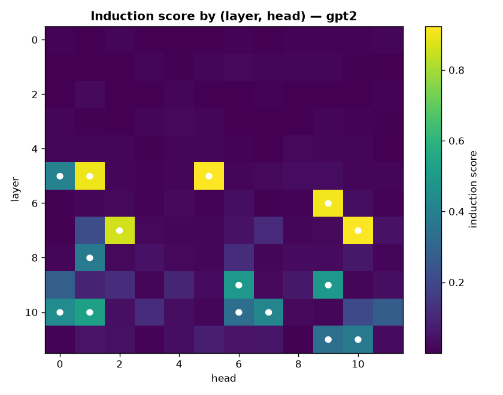
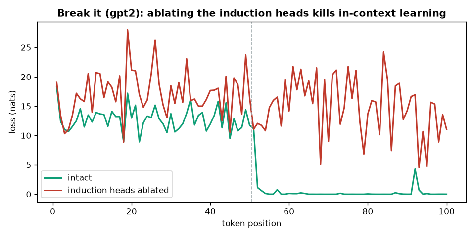

### 02 — Random-head control (specificity)

Maybe removing *any* k heads hurts that much? Ten seeded trials ablate the same number of
randomly chosen non-induction heads from the same layer pool. They barely move the loss;
the induction ablation sits 10–34σ outside the random distribution. The damage is
specific to the circuit, not to losing k heads.

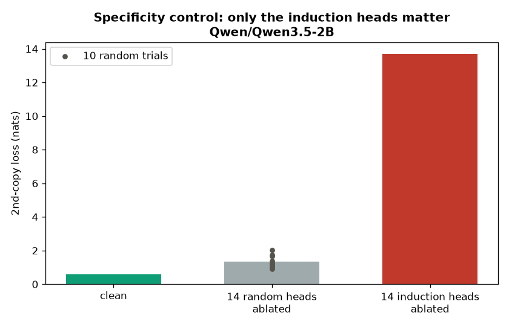

### 03 — Previous-token heads (composition)

Induction heads don't work alone: an earlier **previous-token head** writes "the token
before me was X" into each position, and the induction head reads that signal
(K-composition). This experiment ablates only the upstream prev-token heads and re-scores
the induction heads *inside the broken model*: their attention stripes collapse even
though they were never touched. GPT-2 needs a wider cut (its prev-token signal is spread
across ~10 weak heads — a redundancy dose-response you can reproduce via the threshold
CLI arg), while Qwen3.5-2B has no softmax prev-token heads at all.

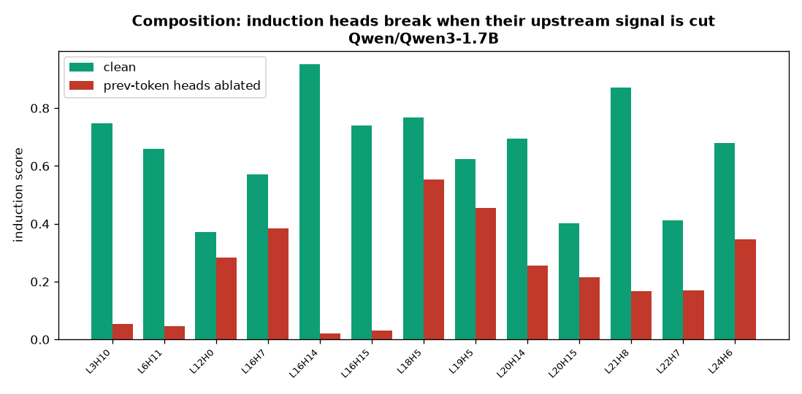

### 04 — Layer-knockout profile (tracing the circuit into linear attention)

Qwen3.5's linear-attention layers have no attention patterns to score — but they can
still be cut. Knocking out one attention sublayer at a time and re-measuring the
induction heads' stripes *inside the ablated model* yields a layer-by-layer dependency
profile (a lesion study). In GPT-2 the profile validates the method: layer 0 is
foundational, and the prev-token layers dip mildly (redundancy, as found in 03). In
Qwen3.5-2B, the **linear layers immediately preceding the two main induction layers dip
hardest** (L14 feeding L15, L10 feeding L11): the shifted-token signal appears to be
supplied just-in-time by adjacent linear-attention layers rather than by one early
dedicated layer — consistent with linear attention acting as a local shift register.

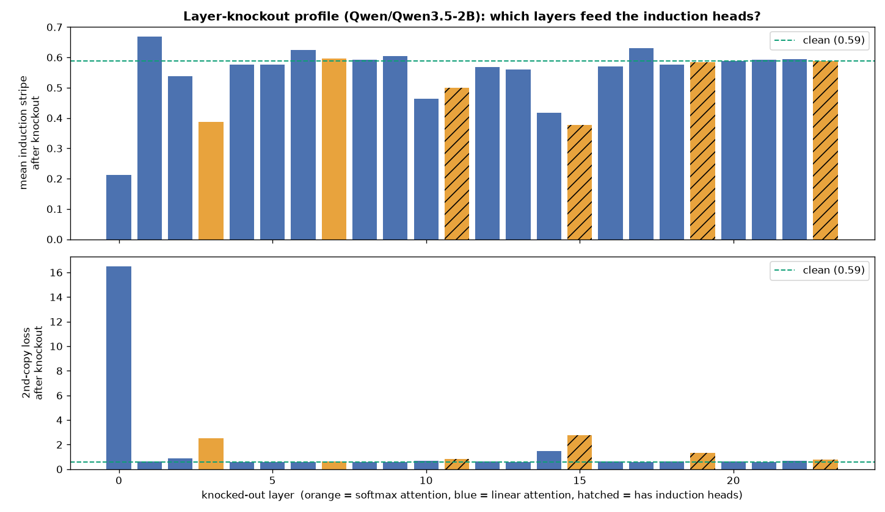

### 05 — Iterative ablation (hunting the Hydra effect)

Why does ablating Qwen3-1.7B's induction heads only hurt 2.9×? Zero-ablation measures
the **total effect** after the network re-routes through backups (self-repair, a.k.a. the
Hydra effect) — so this experiment ablates, **re-scores every remaining head inside the
broken model**, recruits the backups that light up, and repeats until none remain.
GPT-2 and Qwen3.5-2B converge in one round with zero recruits: their single-ablation
numbers were honest. Qwen3-1.7B is the Hydra: round 2 recruits three backup heads
(L21H9, L8H5, L18H4), lifting the damage from 2.9× to 4.5× — yet still nowhere near
GPT-2's 36.5×, so most of its robustness is *diffuse*, spread below any thresholdable
head. Backup heads are invisible in the clean model by construction: no amount of better
scoring finds them — only breaking the primary circuit does.

The per-round heatmaps make the recruitment visible — grey cells are ablated heads,
dots mark the heads recruited from that panel. The backup heads in the middle panel sit
on cells that were dark in the clean model. The stopping rule is threshold-relative:
rerunning at threshold 0.2 recruits 29 heads over the same 2 rounds for 6.0× — still far
below GPT-2's 36.5×, so the diffuse-compensation conclusion holds at every depth.

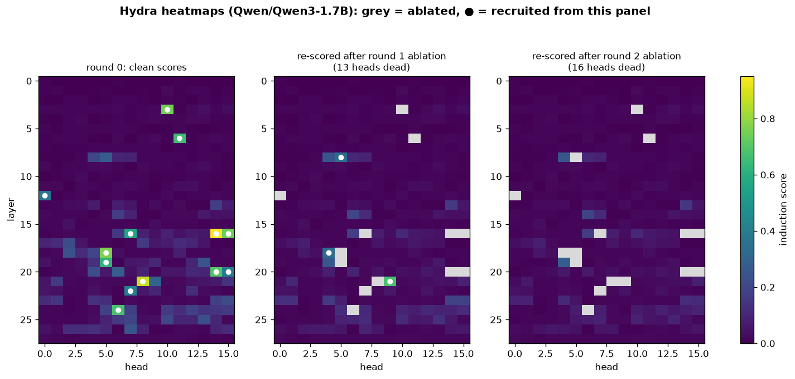
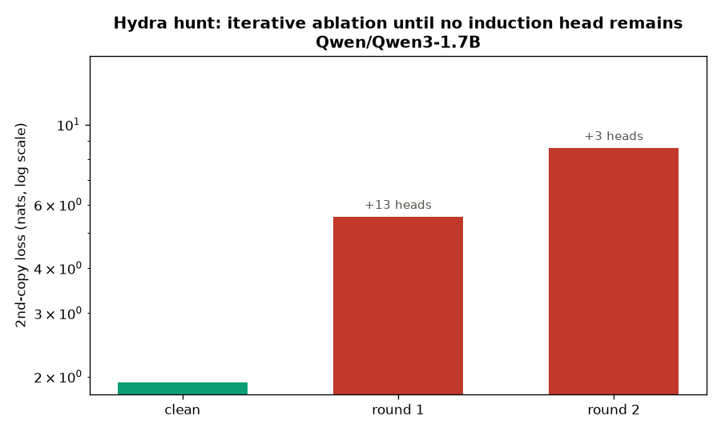

### 06 — Mean vs zero ablation (is the self-repair real?)

Zeroing an activation pushes the residual stream off-distribution, which can itself fake
"self-repair" (LayerNorm renormalises what's left). Mean ablation replaces each head's
output with its average over 16 reference sequences — deleting its information while
keeping the statistics in-distribution. Result: Qwen3-1.7B's mean-ablation damage (3.0×)
matches zero-ablation (2.9×), so its robustness is **genuine functional redundancy**, not
an artifact. In GPT-2 and Pythia, zeroing *overstated* the damage ~1.5× (off-distribution
shock on top of information removal) — a calibration worth knowing, though every
conclusion survives it.

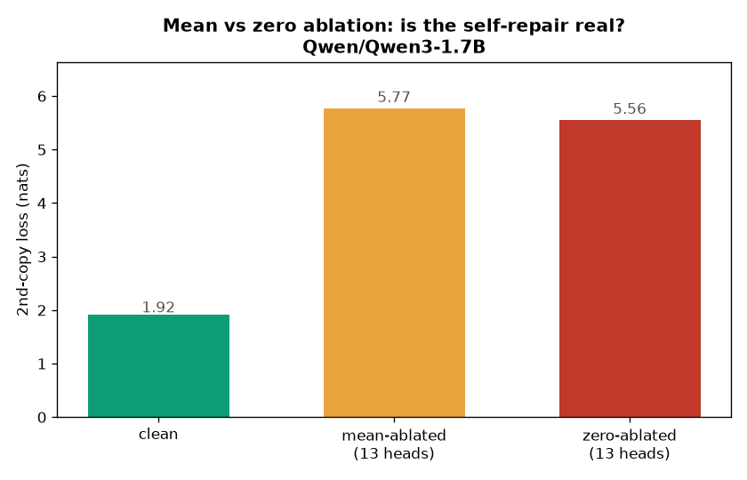

### 07 — Emergence (watching the phase change)

Induction heads aren't learned gradually — they emerge in a sudden phase change partway
through training, and in-context learning appears at the same instant (Olsson et al.,
2022). Sweeping 14 published Pythia-160m training checkpoints with the same measurements
as experiment 01 reproduces it: between step 512 and step 1000 (~1–2B tokens) the top
induction score jumps **0.06 → 0.90** while the 2nd-copy loss crashes **12.9 → 3.9** —
and the 1st-copy loss (the built-in control: random tokens are unpredictable no matter
how good the model gets) stays flat at ~13 for the entire 143k-step run.

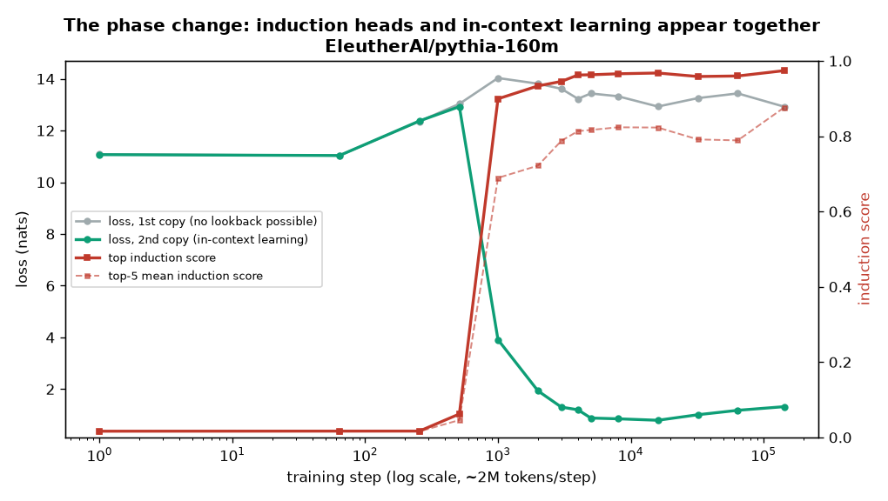
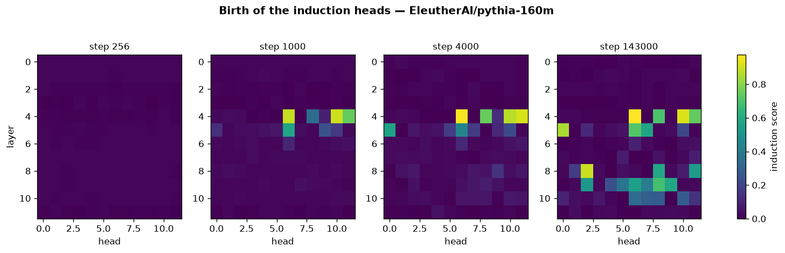

### 08 — The refusal direction (a safety application)

The same locate-then-intervene playbook, aimed at safety. Refusal in chat models is
mediated by a single direction in activation space (Arditi et al., 2024): the difference
between the mean residual-stream activation on harmful vs harmless prompts. Extracting it
from Qwen2.5-1.5B-Instruct (layer 21) and intervening across all layers gives a clean
double dissociation — **projecting the direction out** drops harmful-prompt refusal from
100% to 17% (necessary), while **adding it in** drives harmless-prompt refusal from 0% to
100% (sufficient). Structurally this is experiment 01's ablation moved from an attention
head to a direction. It's also the tool behind an open safety question: if a model that
was "unlearned" starts answering forgotten questions once this direction is removed, its
unlearning was really disguised refusal — the knowledge was never gone.

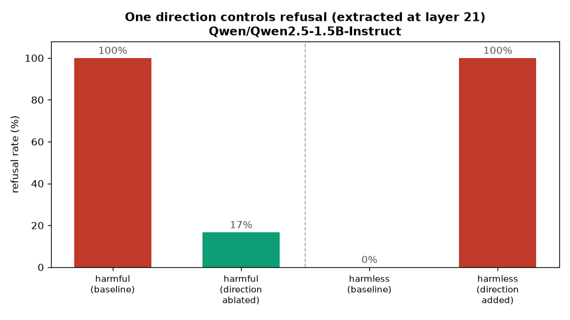

`refusal_heads.py` builds the induction-heatmap analog: dotting each attention head's
output with the refusal direction gives a layer × head map of **which heads write refusal**
— concentrated in the upper-middle layers, just as induction heads sit mid-network.

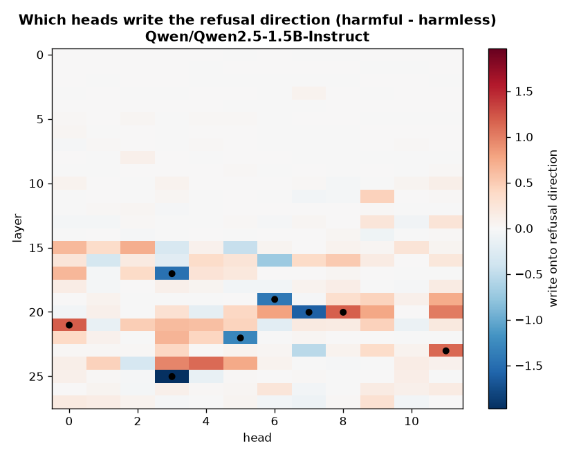

### 09 — Did the model forget, or just suppress? (Project 3)

The payoff experiment. Unlearning methods claim to *remove* knowledge, but "won't answer"
looks identical whether the knowledge is gone or hidden behind a refusal-like reflex.
Using the experiment-08 tool, we ablate a suppression direction on TOFU-unlearned
Llama-3.2-1B checkpoints and measure whether the forgotten authors' answers come back
(ROUGE-L recall). Two references anchor the scale: `full` (knows the authors, 0.79) and
`retain90` (never learned them, 0.36) — and `retain90` is the control that makes it
trustworthy, since ablation leaves it flat (you can't recover what was never there).

The honest result is more nuanced than the hypothesis predicted. GradDiff and NPO do
suppress generation to (or below) the never-learned floor — NPO's 0.13 sits *under* the
floor, the signature of active refusal-like suppression rather than mere ignorance — but
ablating the refusal direction only nudges them back up (GradDiff +0.03, NPO +0.06),
nowhere near the 0.79 ceiling. So at this scale the refusal direction is **not** a master
key that undoes GA/NPO forgetting. The surprise is RMU: on free-form generation this
checkpoint still answers forget questions (0.73 ≈ `full`), so its "unlearning" is
metric-dependent — it doesn't show up in greedy generation at all. (Scope: generation
ROUGE only; TOFU's probability/truth-ratio metrics may rank RMU differently.)

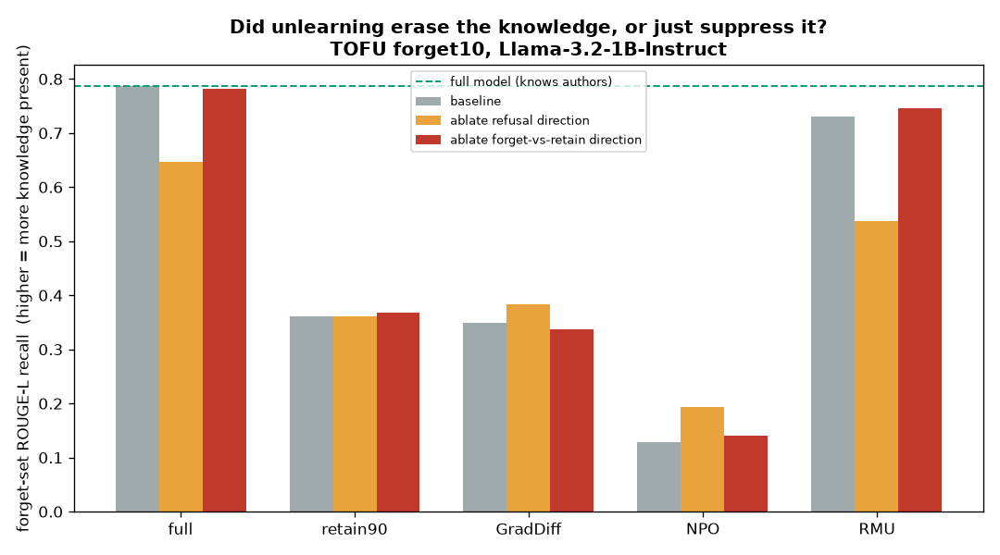

## Reproducing

Requirements: Python 3.12, CUDA GPU (~12 GB; models load in bf16), and:

```bash
pip install torch transformer_lens matplotlib
```

Every script takes an optional model name (default `gpt2`) and writes charts + token
dumps to its own `results/` folder:

```bash
python 01_induction_heads/induction_heads.py
python 01_induction_heads/induction_heads.py Qwen/Qwen3-1.7B
python 02_random_control/random_control.py Qwen/Qwen3.5-2B
python 03_prev_token_heads/prev_token_heads.py gpt2 0.3   # optional prev-token threshold
python 04_layer_knockout/layer_knockout.py Qwen/Qwen3.5-2B
python 05_iterative_ablation/iterative_ablation.py Qwen/Qwen3-1.7B
python 06_mean_ablation/mean_ablation.py EleutherAI/pythia-1.4b
python 07_emergence/emergence.py            # sweeps 14 Pythia-160m checkpoints, resumable
python 08_refusal_direction/refusal_direction.py
python 08_refusal_direction/refusal_heads.py        # refusal-writer heatmap
python 09_unlearning_refusal/unlearning_refusal.py  # downloads 5 TOFU checkpoints, resumable
```

Newer architectures absent from `HookedTransformer`'s registry (e.g. Qwen3.5) load
automatically through TransformerLens's `TransformerBridge` with compatibility mode.
Everything is seeded — reruns reproduce the numbers above exactly. Cross-model caveat:
different tokenizers draw different random stimuli, so compare clean-vs-ablated *ratios*
within a model, not raw loss across models.

## References

- Elhage et al., [*A Mathematical Framework for Transformer Circuits*](https://transformer-circuits.pub/2021/framework/index.html) (Anthropic, 2021)
- Olsson et al., [*In-context Learning and Induction Heads*](https://transformer-circuits.pub/2022/in-context-learning-and-induction-heads/index.html) (Anthropic, 2022)
- Nanda et al., [TransformerLens](https://github.com/TransformerLensOrg/TransformerLens)
